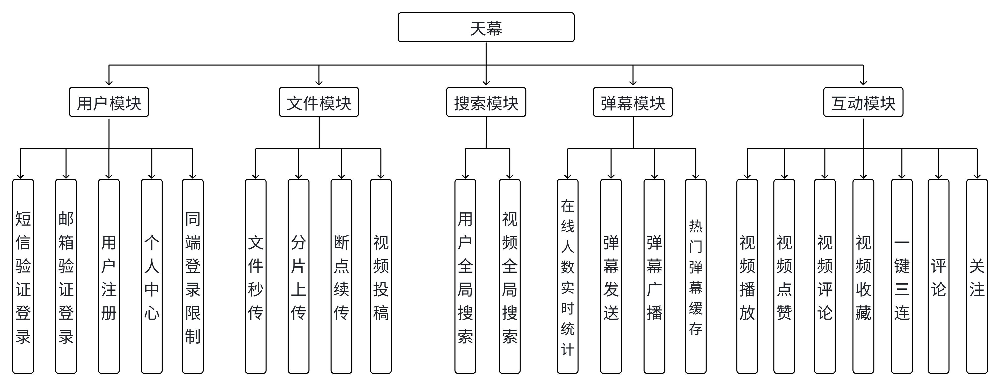
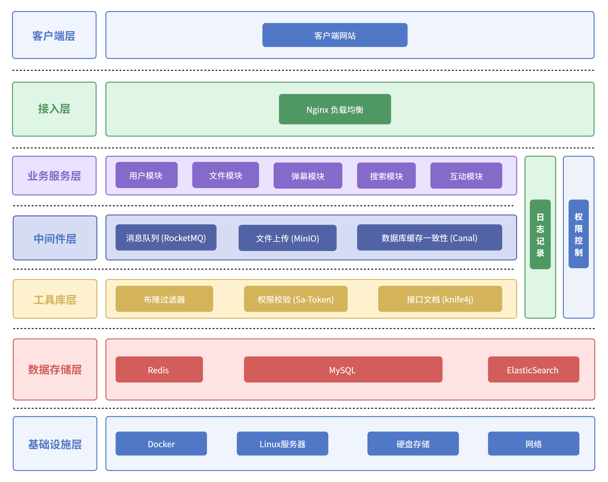

# 天幕视频平台

天幕是一个前后端分离的视频社区项目，包含用户注册登录、视频投稿与播放、分类检索、关注收藏、点赞评论、弹幕和文件上传等功能。



## 技术栈

- 前端：Vue 3、Vue Router、Pinia、Element Plus、Axios、ArtPlayer
- 后端：Java 17、Spring Boot 3、MyBatis-Plus、MySQL、Redis
- 中间件：MinIO、RocketMQ、Elasticsearch、Canal



## 项目结构

```text
.
├── backend/        Spring Boot 后端源码及部署模板
├── frontend/       Vue 前端源码
└── docs/           项目说明图片
```

## 本地运行

### 1. 准备依赖服务

启动 MySQL、Redis、Elasticsearch、MinIO、RocketMQ 和 Canal，并根据实际环境设置配置变量。后端支持的完整变量可参考 [`backend/deploy/prod.env.example`](backend/deploy/prod.env.example)。

所有 `CHANGE_ME` 都必须在运行前替换。仓库不包含真实密码、访问密钥或服务器地址。

### 2. 启动后端

```bash
cd backend
./mvnw spring-boot:run
```

Windows PowerShell 可运行：

```powershell
cd backend
.\mvnw.cmd spring-boot:run
```

后端默认地址为 `http://127.0.0.1:8101/api`，弹幕 WebSocket 默认端口为 `9101`。

### 3. 启动前端

```bash
cd frontend
npm ci
npm run serve
```

前端开发服务器默认代理到 `http://127.0.0.1:8101`。如需修改接口或弹幕地址，可复制 [`frontend/.env.example`](frontend/.env.example) 为本机环境文件后调整。

## 构建

```bash
cd backend
./mvnw clean package

cd ../frontend
npm ci
npm run build
```

生产部署注意事项参见 [`backend/deploy/README-prod.md`](backend/deploy/README-prod.md)。

## 安全说明

- 不要提交 `.env`、`prod.env`、密码、Token、SMTP 授权码或云服务器密钥。
- 不要将 MySQL、Redis、Elasticsearch、RocketMQ、Canal 等中间件端口直接开放到公网。
- 示例配置仅用于说明变量格式，部署时请使用独立强密码并限制安全组来源。

## 许可说明

本仓库暂未附加开源许可证，仅用于个人学习、项目展示和授权范围内的交流。
